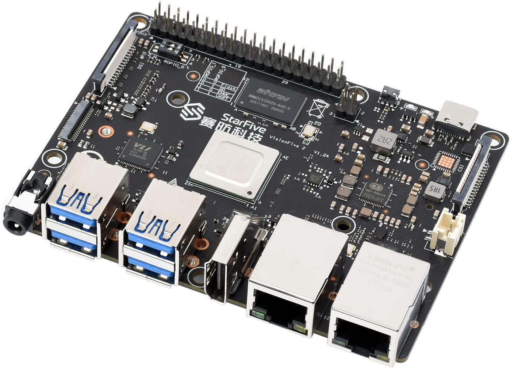

# Yocto Demo Image for StarFive VisionFive 2 (JH7110)

A polished, opinionated Yocto demo image for the StarFive VisionFive 2
(JH7110 RISC-V SBC): **a clean SD flash boots, with zero manual steps, to a
GPU-composited touch dashboard on a 10.1″ MIPI-DSI panel — with Doom
launchable by touch** — layered on top of the `meta-riscv` BSP.



**What the image does from a cold power-on, hands off:**

1. Boot splash (psplash) as soon as the DSI panel lights (~19 s)
2. Weston, **GPU-composited on the PowerVR BXE-4-32**, rotated to landscape
3. A fullscreen **touch status dashboard** (lighttpd + CGI, WebKit kiosk):
   live system/memory/network/storage/display stats, 5 s refresh
4. **Doom** (doomgeneric + freedoom) started/stopped from the dashboard by
   touch; plays with a USB keyboard
5. The same status page served on the LAN at `http://visionfive2.local/`

**Key technologies:** **Yocto** (wrynose) | **StarFive JH7110** (4× SiFive
U74 RV64GC @ 1.5 GHz) | **Imagination BXE-4-32** (GLES 3.2, closed DDK) |
**10.1″ MIPI-DSI + GT9271 touch** | **ESWIN ECR6600U WiFi** | **Linux**
6.12.5 (StarFive vendor fork) | **U-Boot** 2026.01 (mainline)

## Hardware

- **Board:** StarFive VisionFive 2 v1.3B (see `docs/VisionFive2_PB.pdf` /
  `docs/VisionFive2_Datasheet.pdf`)
- **SoC:** JH7110 — 4× SiFive U74 (RV64GC) up to 1.5 GHz + S7 monitor core
- **GPU:** Imagination BXE-4-32 — GLES 3.2 via the closed DDK 1.19
  (version-locked to the vendor 6.12 kernel; no Vulkan-to-display)
- **Panel:** 10.1″ 800×1280 MIPI-DSI (ILI9881C) + GT9271 capacitive touch,
  on the 2-lane DSI port via a 22-pin → 15-pin RPi-style converter cable
- **Networking:** 2× GbE (eth1 is the working port on this board — see
  `docs/PRODUCTIONIZE.md` #7), optional ECR6600U USB WiFi
- **Boot media:** microSD (this image), eMMC, QSPI NOR, UART recovery

## What made it work (the interesting bits)

All in `meta-visionfive2-demo` — no forks of the BSP or kernel source, only
`.cfg` fragments, patches applied at build, a board DTS, and bbappends:

| Fix | Problem it solves |
|---|---|
| `randstruct.cfg` | `CONFIG_RANDSTRUCT_FULL` (silently on via `COMPILE_TEST`) soft-locked the closed PowerVR DDK at module init — the GPU showstopper |
| `0004` panel init | The real vendor "10inch1" ILI9881C init uses a register-0xE0 bank model, not the mainline 0xFF-page switch — without it the glass stays black |
| `0005` host ordering | The vendor cdns-dsi host had no `.pre_enable`, so the panel init ran before the DSI link/PHY were up |
| `0006` VSG self-heal | Upstream-known cdns-dsi first-enable race: the video stream generator misses the first vsync and never starts. Self-heal: PHY power-cycle + re-arm; the next fb-client modeset completes recovery. Deterministic cold-boot panel |
| `0007` touch poll | The converter cable routes no touch INT line — GT9271 driven by a 60 fps I2C poll instead |
| `WESTON_DISABLE_GBM_MODIFIERS` | The dc8200 display controller cannot scan out PVR tiled/modifier buffers (symptom: a column of dots). Linear buffers → GPU-composited Weston works |
| rc.pvr start-only links | The DDK module panics in `pvr_exit` on rmmod — shutdown links removed so every reboot is clean |
| lighttpd keep-alive 30 s | Default 5 s idle races the dashboard's 5 s refresh; libsoup surfaces it as "Connection terminated unexpectedly" |

## Build from source

`wrynose` is split-repo; layers are cloned via `setup-layers` (reads the
pinned SHAs in `setup-layers.json`).

```bash
git clone https://github.com/OOHehir/starfive-visionfive2-yocto.git
cd starfive-visionfive2-yocto

./setup-layers        # clone all layers at pinned SHAs into sources/

# HOST PREREQUISITE: git-lfs on PATH (the closed GPU/VPU blobs are Git LFS):
#   sudo apt install git-lfs && git lfs install

source sources/oe-core/oe-init-build-env build
cp ../local.conf.sample conf/local.conf
cp ../bblayers.conf.sample conf/bblayers.conf

bitbake visionfive2-demo-image
```

Output: `build/tmp/deploy/images/visionfive2/visionfive2-demo-image-visionfive2.rootfs.wic.gz`
(plus a `.wic.bmap`). `core-image-weston` also builds, as the plain base.

## Flash and first boot

```bash
# Guard-railed helper (refuses non-removable/non-USB/oversized targets,
# verifies the write by read-back):
VF2_WIC=build/tmp/deploy/images/visionfive2/visionfive2-demo-image-visionfive2.rootfs.wic.gz \
    ./scripts/flash-sd.sh /dev/sdX

# or plain dd:
gunzip -c <image>.wic.gz | dd of=/dev/sdX bs=4M conv=fsync
```

Insert the card and power on. Two supported boot paths:

- **MSEL = QSPI (factory default):** the on-flash U-Boot distro-boots the
  card's GRUB/EFI `/boot` (needs a sane `bootdelay`, e.g. 2 — the image's
  `/boot` carries everything else including the DSI device tree).
- **MSEL = SDIO:** fully self-contained — the card carries its own SPL and
  U-Boot partitions.

See `docs/FIRST_BOOT.md` for the expected boot sequence and how to drive
Doom. WiFi credentials are never baked in: configure `wpa_supplicant` at
runtime (`iw`/`wpa-supplicant` are in the image).

## Dev loop — TFTP netboot

Development iterates over **TFTP netboot** (kernel + initramfs into RAM, no
SD reflashing): `scripts/vf2-netboot.py` drives the whole cycle over the
debug UART — detects a booted Linux and reboots it, aborts on failed
transfers, and boots with `panic=10` so even a kernel panic self-recovers to
the U-Boot prompt. `scripts/mk-bringup-initramfs.sh` repacks the
freshly-built rootfs with bench-only tweaks (SSH key, diagnostics knobs).
`scripts/vf2-uart-boot.py` provides UART XMODEM/YMODEM recovery and QSPI
reflash if the boot chain is ever damaged. See `docs/DEV_SETUP.md`.

## Boot chain

```
BootROM → SPL → U-Boot 2026.01 + OpenSBI (FW_DYNAMIC FIT)
        → GRUB (EFI, from SD /boot) → Linux 6.12.5 (full DSI device tree)
```

Two env-only U-Boot notes (no source fork — `DEV-NOTES.md` has the forensics):
`preboot` must not run `usb start` (VF2's xHCI corrupts the heap in mainline
U-Boot and the kernel handoff store-faults), and netboot development expects
the prompt reachable over serial.

## Source versions

Pinned in `setup-layers.json` (the source of truth):

| Component | Repository | Branch | Commit |
|-----------|-----------|--------|--------|
| Kernel | StarFive fork via `meta-riscv` `linux-starfive-dev` | `JH7110_VisionFive2_6.12.y_devel` (6.12.5) | `4cecf169` |
| U-Boot + OpenSBI + SPL | mainline `u-boot` 2026.01 via `meta-riscv` | — | `2026.01` |
| GPU DDK | `visionfive2-pvr-graphics` 1.19 (Imagination, closed) | soft_3rdpart | `b60da16` |
| Mesa (PowerVR fork) | `mesa-pvr` 22.1.3 | — | 22.1.3 |
| bitbake | `openembedded/bitbake` | `2.18` | `acfe02fa` |
| openembedded-core | `openembedded/openembedded-core` | `wrynose` | `c2746a4a` |
| meta-yocto | `yoctoproject/meta-yocto` | `wrynose` | `824795b8` |
| meta-openembedded | `openembedded/meta-openembedded` | `wrynose` | `10002797` |
| meta-riscv | `riscv/meta-riscv` | `wrynose` | `50941215` |

## Repo guide

- `meta-visionfive2-demo/` — the demo layer: image recipe, kernel
  patches/DTS/fragments, Doom + kiosk + status-webserver recipes, weston/
  psplash/network bbappends, the demo `.wks`
- `DEV-NOTES.md` — the bring-up findings: every non-obvious problem this
  board threw and its fix (worth reading before any JH7110 display/GPU work)
- `docs/DEV_SETUP.md` — host + bench setup
- `docs/PRODUCTIONIZE.md` — runtime-workaround tracker (what's folded into
  recipes and what remains)
- `docs/GPU_VERIFY.md` — how to confirm PowerVR acceleration vs a softpipe
  regression
- `docs/FIRST_BOOT.md` — the expected first-boot experience
- `scripts/` — bench tooling (netboot, flashing, UART recovery, serial)

---

Built by Owen O'Hehir — embedded Linux, IoT, Matter & Rust consulting at
[electronicsconsult.com](https://electronicsconsult.com). Available for
contract and consulting work.
